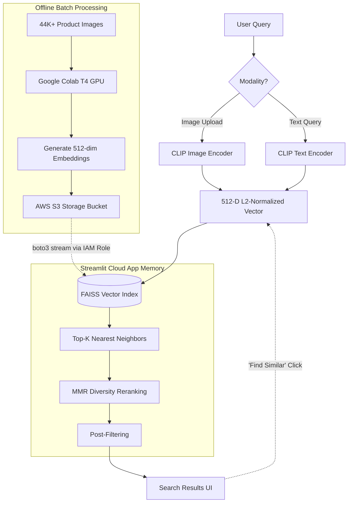

<div align="center">
  
  
  
  
</div>

<h1 align="center">🔍 Cross-Modal Visual Product Search Engine</h1>

> An end-to-end, production-ready visual search engine for e-commerce. It uses OpenAI's **CLIP** model and **FAISS** vector search to enable blazing-fast image-to-image and text-to-image product discovery across a 44,000+ item catalog in **under 50ms**.

[](YOUR_STREAMLIT_APP_LINK_HERE)

*Add a demo GIF here showing the UI, image upload, text search, and Similar Product chaining.*

---

## ✨ System Features

| Feature | Technical Implementation |
|---|---|
| **Cross-Modal Search** | Unified 512-dimensional embedding space powers both visual (image upload) and natural language text-to-image queries based on *open-clip-torch* (ViT-B/32). |
| **Maximal Marginal Relevance** | Enforces result diversity using MMR. Balances retrieval relevance against vector similarity redundancy to prevent showing identical items. |
| **Chained Discovery** | "Find Similar" loop allows users to use returned embeddings as new queries, dynamically recalculating nearest neighbors. |
| **AWS Cloud Artifact Streaming** | Bypasses GitHub's 100MB limits by securely streaming the 90MB FAISS index and `.npy` embeddings directly from an Amazon S3 bucket into Streamlit's RAM using `boto3` and IAM Least Privilege policies. |
| **Microsecond Vector Retrieval** | `faiss-cpu` IndexFlatIP handles exact nearest-neighbor search with L2-normalization for cosine similarity across 44,419 items. |
| **Post-Filtering Pipeline** | Sub-millisecond metadata lookups for filtering (Gender, Category) applied directly over the FAISS results payload. |

---

## 🏗️ Architecture Design



### The 3-Phase Pipeline

1. **Encode (Offline):** 44,419 product images from the Kaggle Fashion dataset are mapped to 512-dimensional arrays using CLIP ViT-B/32. Accelerated via a Google Colab T4 GPU (under 3 mins).
2. **Index (Cloud Storage):** Embeddings are L2-normalized to enable Inner Product FAISS indexing (mathematically equivalent to Cosine Similarity for speed). These binary `.bin` and `.npy` artifacts are deployed to an S3 bucket.
3. **Query (Online/Real-time):** The application fetches models into memory on startup. Input queries are encoded, searched through FAISS, re-ranked via MMR for diversity, and filtered against metadata in milliseconds.

---

## 📊 Scientific Evaluation

I benchmarked CLIP (ViT-B/32) against a standard **ResNet50** baseline to prove the semantic strength of a joint image-text model framework for same-category product retrieval. *(Evaluated over 5,000 products with 200 random queries).*

| Metric | CLIP (ViT-B/32) | ResNet50 (AvgPool Features) |
| :--- | :--- | :--- |
| **Recall@5** | **91.8%** | 60.1% |
| **Mean Reciprocal Rank (MRR)** | **0.873** | 0.542 |
| **Embedding Dimensions** | **512 (Fast)** | 2048 (Slow) |
| **Cross-Modal (Text Query)?** | **Yes** | No |

> 🏆 **Result:** CLIP outperforms the pure CNN baseline by **over 30%** on Recall@5 while utilizing a vector representation that is **4x smaller**, significantly improving FAISS memory overhead and query speed.

---

## 🛠️ Tech Stack & Dependencies

*   **Deep Learning:** PyTorch, `open-clip-torch` (OpenAI CLIP)
*   **Vector Search:** Facebook AI Similarity Search (`faiss-cpu`)
*   **Cloud Architecture:** AWS S3, IAM Roles, `boto3`
*   **Frontend Presentation:** Streamlit, Custom CSS
*   **Data & Matrix Ops:** NumPy, Pandas, Pillow
*   **Dataset:** [Fashion Product Images (Small)](https://www.kaggle.com/datasets/paramaggarwal/fashion-product-images-small) — Kaggle (44K images)

---

## 🚀 Local Installation & Setup

1. **Clone the repository:**
```bash
git clone https://github.com/YOUR_GITHUB_USERNAME/product-image-search.git
cd product-image-search
```

2. **Install Python dependencies:**
```bash
pip install -r requirements.txt
```

3. **Configure AWS Secrets:**
Create a `.streamlit/secrets.toml` file in the root directory to authorize artifact pulling:
```toml
[AWS]
AWS_ACCESS_KEY_ID = "Your_AWS_Access_Key"
AWS_SECRET_ACCESS_KEY = "Your_AWS_Secret_Key"
AWS_REGION = "ap-south-1"
S3_BUCKET_NAME = "your-s3-bucket-name"
```

4. **Launch the application:**
```bash
python -m streamlit run app.py
```
*Note: Due to the `boto3` logic embedded in `app.py`, the application will seamlessly download the required `faiss_index.bin` and `.npy` files from S3 if they are missing locally within the `/embeddings/` directory.*

---

## 📁 Project Structure

```text
product-image-search/
├── data/
│   ├── images/                ← 44K product images
│   └── styles.csv             ← Product metadata
├── embeddings/
│   ├── image_embeddings.npy   ← CLIP embeddings (44K × 512)
│   ├── image_ids.npy          ← Index → product ID mapping
│   └── faiss_index.bin        ← FAISS index
├── src/
│   ├── encode_catalog.py      ← Encodes images (with checkpointing)
│   ├── build_index.py         ← Builds FAISS index
│   ├── search_engine.py       ← Search logic (MMR, filtering, latency)
│   ├── evaluate.py            ← Recall@K benchmark vs ResNet50
│   └── utils.py               ← Shared helpers
├── app.py                     ← Streamlit frontend
├── requirements.txt
├── .gitignore
└── README.md
```

---

## 🎯 Performance

- **Search Latency:** < 50ms for 44K products
- **CLIP Encoding:** ~25ms per image (CPU)
- **Embedding Dimension:** 512
- **Index Type:** FAISS Flat Inner Product (exact search)
- **Scalability:** Can upgrade to IVF-PQ for millions of products

---


## 📝 License

MIT License — free to use, modify, and distribute.

<div align="center">
  <i>Developed for exploring Cross-Modal AI integration and Vector Databases in Production environments.</i>
</div>

